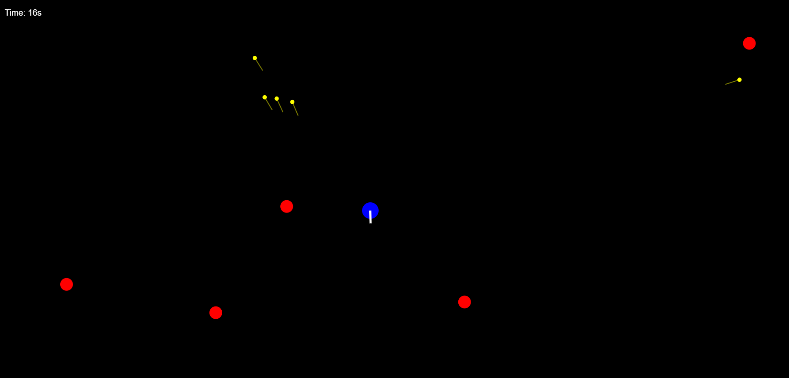

# 🎯 Basic Shooting Game

A lightweight, browser-based shooting game built using **HTML** and **JavaScript** — no frameworks, no build tools.  
Simply open it in a browser and start playing! Perfect for learning the basics of **game loops**, **rendering**, and **player interactions**.

---

## 📸 Game Preview

    

---

## 🎮 Gameplay

- **Objective**: Control the blue player and shoot down enemies (red circles) before they reach you.  
- **Controls**:
  - **Mouse Move** — Aim  
  - **Left Click** — Shoot (fires yellow bullets)  
- **Score / Time**: A timer is displayed at the top left, tracking how long you survive.

---

## 📂 Project Structure

